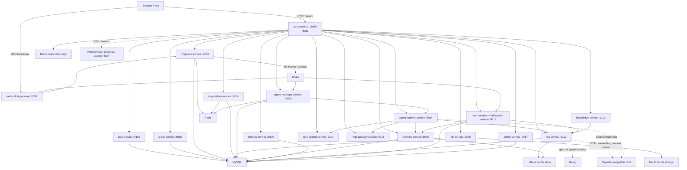

# ClaranAIM

ClaranAIM 是一个 Agent-Native AIM 系统，AIM = Agent + Instant Messaging

它不是把聊天机器人挂在 IM 旁边，而是把 Agent 设计成 IM 里的原生成员：Agent 拥有身份、会话、权限、记忆、Skill、MCP 工具和审计记录，可以进入私聊和群聊，理解真实聊天上下文，处理文件与知识库，在协作链路里执行任务并沉淀结果

在 ClaranAIM 里，IM 不只是消息 UI，而是 Agent 的上下文入口、事件总线、权限边界和协作现场。人和 Agent 可以在同一条会话链路中讨论、调用工具、检索知识、生成摘要、追踪执行过程，并让关键结论进入长期记忆和系统治理流程

本项目Agent模块草台，这部分很多东西都只是MVP，待全面合理优化（上下文管理、向量记忆写回召回、记忆时效性/权重、tool calling & function calling、数据库mcp、skill工程、多agent协作）

另：展示还未测试docker-compose，测试后会在readme此处更新说明
## 核心能力

- **Agent 原生 IM**：Agent 可作为真实系统用户进入私聊和群聊，读取授权上下文，执行总结、问答、洞察、回复建议、Skill 和工具调用
- **可靠消息同步**：支持 WebSocket 实时推送、上线同步、用户级同步游标、ACK 重试、乱序补偿和多端去重合并，ACK 表示设备收到，不等同于已读
- **Conversation Intelligence**：会话活动可自动或手动归档为摘要、决策、待办、主题、引用和候选记忆，并写入长期 RAG / Memory 治理链路
- **未读摘要**：聊天页提供“我错过了什么”，只总结当前用户未读范围，不自动标记已读
- **RAG 与知识图谱**：支持文档上传、异步解析、OCR、Hybrid Search、Rerank、GraphRAG、知识图谱查询、关系审核、文档图谱重建和可视化
- **MCP / Tool / Skill**：提供 MCP Server 配置、工具调用、调用追踪、Agent Skill 上传、运行测试和工具执行标识
- **系统治理台**：管理员可管理用户、群组、文件、Agent、账单、审核、MCP 调用、公告、审计和可观测性入口，并可把其他用户设为管理员或降回普通用户
- **可观测性**：接入 OpenTelemetry、Prometheus、Grafana、Jaeger、ELK 和本地日志目录，便于排查网关、Kitex 服务、Agent 和 RAG 链路

## 架构图



## 服务简介

| 服务 | 端口 | 类型 | 简介 |
| --- | --- | --- | --- |
| `api-gateway` | `18080` | Hertz HTTP | 浏览器统一 HTTP 入口，承载 `/api/v1/*`、鉴权、限流、文件预览、管理路由和内部 RPC 聚合 |
| `websocket-gateway` | `8081` | WebSocket | IM 实时连接网关，消费消息事件并推送到在线端 |
| `user-service` | `9101` | Kitex RPC | 用户、登录、Token、个人资料、好友、好友分组和角色基础能力 |
| `group-service` | `9002` | Kitex RPC | 群组、成员、角色、禁言、邀请、转让和群状态治理 |
| `msg-core-service` | `9003` | Kitex RPC | 会话、消息写入、编辑、撤回、已读、本地删除、Outbox 和同步游标 |
| `msg-history-service` | `9004` | Kitex RPC | 历史消息、离线索引、未读统计和消息检索 |
| `file-service` | `9005` | Kitex RPC | 文件元数据、MinIO / 本地存储引用、下载和治理信息 |
| `agent-manager-service` | `9006` | Kitex RPC | Agent 配置、权限、路由规则、事件调度、审计、计费和运行记录 |
| `agent-runtime-service` | `9007` | Kitex RPC | Eino Agent 运行时、工具安全策略、Skill 注入、长会话和任务执行 |
| `memory-service` | `9008` | Kitex RPC | 长期记忆、候选记忆、Memory-RAG、Milvus 召回和用户记忆治理 |
| `settings-service` | `9009` | Kitex RPC | LLM 预设、Prompt 模板、Skill 包、MCP Server 配置和密钥加密存储 |
| `rag-service` | `9112` | Kitex RPC | 文档入库、解析、OCR、chunk、embedding、Hybrid Search、Rerank 和 GraphRAG 构建 |
| `knowledge-service` | `9113` | Kitex RPC | 知识图谱查询、节点详情、边详情、邻域、路径和前端图谱视图聚合 |
| `web-search-service` | `9114` | Kitex RPC | 一次性 Web Search Augmentation，搜索、抓取、清洗和相关段落截取 |
| `conversation-intelligence-service` | `9015` | Kitex RPC | 聊天记录智能归档、未读摘要、摘要产物写入 RAG 和候选记忆生成 |
| `mcp-gateway-service` | `9016` | Kitex RPC | MCP 工具注册、远程 MCP 调用、工具追踪和 Agent 工具统一出口 |
| `admin-service` | `9017` | Kitex RPC | 管理台聚合数据、用户治理、群组治理、文件治理、审核、公告和审计 |

## 技术栈

| 分类 | 技术 |
| --- | --- |
| HTTP 框架 | Hertz |
| RPC 框架 | Kitex、Thrift、TTHeader |
| 服务发现 | Etcd |
| Agent 框架 | Eino |
| 数据库 | MySQL、GORM |
| 缓存 | Redis |
| 对象存储 | MinIO、本地存储 |
| 消息与一致性 | Kafka、Transactional Outbox、DTM Saga |
| RAG | Hybrid Search、BM25、RRF、Rerank、CRAG、Self-RAG、Adaptive Router、parent-child chunk |
| 向量与图谱 | Milvus、Neo4j、GraphRAG |
| 前端 | 原生 HTML、CSS、JavaScript、G6 知识图谱可视化 |
| 认证与安全 | JWT、bcrypt、AES-GCM |
| 配置 | Viper、godotenv、.env、config/*.yaml |
| 日志 | Zap |
| 指标与追踪 | OpenTelemetry、Prometheus client、OTLP HTTP、Jaeger |
| 看板 | Grafana、Prometheus、Jaeger、ELK / Kibana |
| 部署 | Docker Compose、PowerShell / Batch |

## 目录结构

```text
ClaranAIM/
├── cmd/
    ├── api-gateway/
    ├── websocket-gateway/
    ├── user-service/
    ├── group-service/
    ├── msg-core-service/
    ├── msg-history-service/
    ├── file-service/
    ├── agent-manager-service/
    ├── agent-runtime-service/
    ├── memory-service/
    ├── settings-service/
    ├── rag-service/
    ├── knowledge-service/
    ├── web-search-service/
    ├── conversation-intelligence-service/
    ├── mcp-gateway-service/
    └── admin-service/
├── internal/
    ├── api-gateway/                         # HTTP handler、路由、中间件、RPC client
    ├── websocket-gateway/                   # WebSocket Hub、连接管理、事件消费
    ├── user-service/                        # 用户、好友、资料、角色
    ├── group-service/                       # 群组、成员、DTM 分支
    ├── msg-core-service/                    # 会话、消息事实、Outbox、同步游标
    ├── msg-history-service/                 # 历史消息、离线消息、未读统计
    ├── file-service/                        # 文件元数据、存储适配
    ├── agent-manager-service/               # Agent 配置、权限、事件调度、审计、计费
    ├── agent-runtime-service/               # Eino Agent、工具、Skill、长会话
    ├── memory-service/                      # 长期记忆、候选记忆、Memory-RAG
    ├── settings-service/                    # LLM Profile、Prompt、Skill、MCP 配置
    ├── rag-service/                         # 文档解析、检索、GraphRAG
    ├── knowledge-service/                   # 图谱查询与可视化聚合
    ├── web-search-service/                  # 搜索增强
    ├── conversation-intelligence-service/   # 会话归档、未读摘要
    ├── mcp-gateway-service/                 # MCP 工具网关
    └── admin-service/                       # 管理台聚合服务
├── pkg/
    ├── cache/redis/                         # Redis 客户端
    ├── config/                              # 配置加载和环境变量覆盖
    ├── documentparser/                      # 文档解析与 OCR 适配
    ├── dtm/                                 # DTM Saga 封装
    ├── eventbus/                            # Kafka 发布、消费和可靠处理
    ├── events/                              # 统一事件 Envelope 和 topic
    ├── governance/                          # Kitex 超时、熔断、限流配置
    ├── health/                              # 启动健康检查
    ├── idgen/                               # 雪花 ID、十位 UID、十位群号
    ├── jwt/                                 # access token / refresh token
    ├── logger/                              # Zap 日志
    ├── observability/                       # OTel、metrics、trace
    ├── outbox/                              # 事务 Outbox
    ├── password/                            # bcrypt
    ├── response/                            # HTTP 响应封装
├── idl/                                     # Thrift IDL
├── kitex_gen/                               # Kitex 生成代码
├── config/                                  # 各服务 YAML 配置
├── dist/
    ├── index.html
    ├── css/
    └── js/
├── deployment/
    └── docker/
        ├── Dockerfile.service               # 通用服务镜像构建文件
        ├── docker-compose.infra.yaml        # 一体式基础设施 compose
        ├── docker-compose.full.yaml         # 基础设施 + Go 服务 compose
        ├── milvus/
        ├── neo4j/
        └── observability/
├── docs/
    ├── apiDoc.md
    ├── plan.md
    ├── update/
    ├── learn/
    └── AI assistent/
├── scripts/
    ├── service-control.ps1
    ├── start.bat
    ├── stop.bat
    ├── status.bat
    └── e2e-smoke.ps1
├── storage/                                 # 本地运行时文件目录
├── logs/                                    # 本地日志目录
├── .env.example
├── .dockerignore
├── .gitignore
├── go.mod
├── go.sum
└── README.md
```

## 部署方式

### 方式一：Docker 启动基础设施，本地启动 Go 服务


准备环境：

- Go 1.25+
- Docker Desktop / Docker Compose
- Windows PowerShell

复制环境变量：

```powershell
Copy-Item .env.example .env
```

配置项以 `.env.example` 内的注释为准，复制为 `.env` 后按需填写本地密钥、模型、OCR、RAG、可观测性和基础设施地址

首次启动空库时，请在 `.env` 中设置 `BOOTSTRAP_ADMIN_USERNAME`、`BOOTSTRAP_ADMIN_PASSWORD` 和 `BOOTSTRAP_ADMIN_NICKNAME`。`user-service` 只会在 `users` 表为空时创建这个账号并设置为 `admin`，已有任何用户时不会自动创建或修改管理员

启动除 Go 服务外的完整基础设施：

```powershell
docker compose -f deployment\docker\docker-compose.infra.yaml up -d
```

启动本地 Go 服务：

```powershell
scripts\start.bat
```

查看服务状态：

```powershell
scripts\status.bat
```

停止本地 Go 服务：

```powershell
scripts\stop.bat
```

打开前端：

```text
dist/index.html
```

默认访问地址：

- HTTP API：`http://localhost:18080/api/v1`
- WebSocket：`ws://localhost:8081/ws`
- Grafana：`http://localhost:8086`
- Jaeger：`http://localhost:8085`
- Prometheus：`http://localhost:8084`
- MinIO Console：`http://localhost:9001`
- Neo4j Browser：`http://localhost:7474`

### 方式二：Docker Compose 启动基础设施和 Go 服务

复制环境变量：

```powershell
Copy-Item .env.example .env
```

配置项以 `.env.example` 内的注释为准，全量 Docker 模式会由 `docker-compose.full.yaml` 为服务容器注入容器网络地址

如果是清空表后的首次部署，同样需要先在 `.env` 中设置 `BOOTSTRAP_ADMIN_USERNAME`、`BOOTSTRAP_ADMIN_PASSWORD` 和 `BOOTSTRAP_ADMIN_NICKNAME`。管理员引导只在 `users` 表为空时执行一次，后续可在管理面板的用户页把其他用户设为管理员或降回普通用户

启动全量环境：

```powershell
docker compose -f deployment\docker\docker-compose.full.yaml up -d --build
```

查看容器状态：

```powershell
docker compose -f deployment\docker\docker-compose.full.yaml ps
```

查看某个服务日志：

```powershell
docker compose -f deployment\docker\docker-compose.full.yaml logs -f api-gateway
```

停止全量环境：

```powershell
docker compose -f deployment\docker\docker-compose.full.yaml down
```

默认对外暴露：

- `api-gateway`：`http://localhost:18080`
- `websocket-gateway`：`ws://localhost:8081/ws`
- Grafana：`http://localhost:8086`
- Jaeger：`http://localhost:8085`
- Prometheus：`http://localhost:8084`
- MinIO Console：`http://localhost:9001`
- Neo4j Browser：`http://localhost:7474`

## 本地脚本

| 脚本 | 用途 | 是否建议保留 |
| --- | --- | --- |
| `scripts\start.bat` | 日常本地启动入口，调用 `service-control.ps1 start`，会检查基础设施、跳过已运行服务、检测端口占用和启动错误日志 | 保留 |
| `scripts\stop.bat` | 停止当前仓库通过 `go run` 拉起的本地 Go 服务，不处理 Docker 基础设施 | 保留 |
| `scripts\status.bat` | 查看本地服务端口、PID、运行状态和端口占用来源 | 保留 |
| `scripts\service-control.ps1` | `start/stop/status` 的共享实现，避免三个 bat 文件重复维护服务清单和端口检查逻辑 | 保留 |
| `scripts\e2e-smoke.ps1` | 可选本地验收脚本，用于检查前端 JS 语法、Go 包构建和一些文档/目录约束，不是日常启动必需 | 保留 |


## 运维与排障

- 本地服务状态：`scripts\status.bat`
- 本地服务日志：`logs/INFO`、`logs/ERR`
- 本地运行数据：`storage/`
- 基础设施 compose：`deployment/docker/docker-compose.infra.yaml`
- 全量 compose：`deployment/docker/docker-compose.full.yaml`
- 服务镜像 Dockerfile：`deployment/docker/Dockerfile.service`
- 可观测性配置：`deployment/docker/observability/`

## 文档索引

- [API 文档](docs/apiDoc.md)
- [阶段计划](docs/plan.md)
