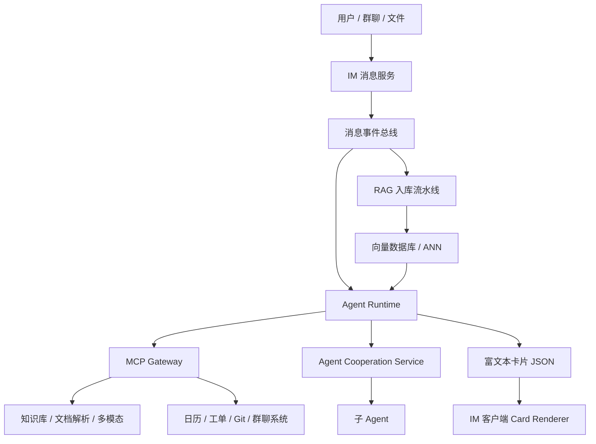

# Agent 原生 IM 与知识系统方案总结

## 1. 核心设想

目标不是把一个 ChatBot 塞进 IM，而是让 Agent 真正成为 IM 中的“用户”。Agent 应该知道自己处在用户、群聊、消息、上下文、文件和任务系统之中，具备类似真实用户的行动能力：主动发起聊天、拉取群聊、创建会话、加好友、@他人、处理文件、调用工具、安排任务、总结群聊。

现实约束是：当前还没有能力让 Agent 永久在线在服务器中。但可以先设计一个“Agent 原生 IM”的最小闭环，让 Agent 以事件订阅者、上下文理解者、工具调用者和协作者的身份存在。

## 2. 基础 IM 与消息系统

### 2.1 身份与数据模型

- 群 ID 可采用 10 位随机数字，降低冲突概率并便于展示。
- Agent 也应被纳入用户体系，拥有用户 ID、会话关系、群成员身份、权限、在线状态和可见上下文。
- 系统消息建议采用“消息内容单份存储 + 用户状态单独维护”的方式。

截图中的系统消息模型可总结为两张核心表：

- `system_message`：保存系统消息正文、类型、状态、创建时间、更新时间等。消息只保存一份，避免对大量用户重复存储。
- `user_message_status`：按用户保存其已读系统消息最大 ID，例如 `last_read_sys_msg_id`。用户上线或刷新时，根据该 ID 拉取之后所有未读消息。

这种设计的好处是存储成本低、群发消息不需要为每个用户立即写入未读记录；代价是要求消息 ID 有序可靠，并且读取未读消息时要结合用户状态计算。

### 2.2 离线消息与实时推送

离线消息可以由独立离线服务兜底：用户上线后主动拉取未读消息；在线用户则通过 WebSocket 获取轻量通知。推荐模式是“推送 + 拉取”：

```json
{
  "event": "system_msg",
  "msg_id": 123
}
```

服务端只通过 WebSocket 推送轻量事件，客户端收到后调用 `/api/messages/unread` 获取完整内容。这样可以降低推送负载，也能兼顾在线体验和离线补偿。

### 2.3 消息分发模型

截图中包含两类典型模型：

- 生产者-消费者模型：适合个人提醒、评论通知、作者动态等点对点或小范围触发任务。
- 发布-订阅模型：适合站内信、系统消息、群发通知等一条消息分发给多个消费者的场景。

发布-订阅可使用 Redis ZSET 维护在线订阅者集合。每个 WebSocket 连接成功后，将在线用户写入有序集合；系统消息产生后，发布者只写一条消息，在线订阅者收到轻量通知，离线用户后续通过未读拉取补齐。

### 2.4 推拉策略与可靠交付

推送策略可分层：

- 定时任务：用于批处理消息队列，可先用 Crontab 实现，后续替换为更稳定的调度服务。
- 快慢队列：快队列处理当前最新消息，慢队列处理长时间未上线用户或历史补偿。
- 实时推送：在线用户通过 WebSocket 收到轻量通知。
- 离线兜底：客户端启动或重连时拉取未读消息。

可靠交付需要三类机制：

- Ack + 重试：服务端发送数据包后等待客户端确认，超时则重发。
- 顺序 Ack：客户端按递增序号确认，例如 `Ack=6` 表示小于等于 6 的包已收到，服务端可丢弃重复包。
- 乱序处理：如果收到 5、6、7 但缺少 4，服务端或客户端应暂存后续包，直到 4 到达后再推进 Ack。

## 3. RAG 与知识系统

### 3.1 最小闭环

基础 RAG 闭环包括：

- 向量数据库
- Embedding
- ANN 近似最近邻检索
- 消息事件或文档内容的向量化入库
- 用户查询时召回相关片段并交给模型回答

这已经是可用的最小闭环，但距离企业级文档知识系统还差三根柱子。

### 3.2 企业级 RAG 的三根柱子

1. 切分质量  
   需要结构感知切分、父子 chunk、标题层级、表格/代码块/列表保护，避免把关键上下文切碎。

2. 检索质量  
   不应只做向量 TopK。更稳的链路是：向量粗筛 → rerank → 精筛 → 最终上下文组装。

3. 可信链路  
   回答必须带原文引用、来源、版本、时间、权限信息，并具备拒答策略。无法从知识库确认的问题，应明确拒答或提示不确定。

### 3.3 双阶段检索

截图中的关键判断是：向量检索擅长“粗筛”，不擅长“精判”；Re-ranker 负责“精判”。

推荐流程：

1. 向量检索拿较大的候选集，例如 `top_k=30~50`。
2. 使用 reranker 重新排序，例如 `bge-reranker`、`jina-reranker`、`cohere rerank`。
3. 取最终 `top_k=5` 左右片段交给 LLM。

Bi-encoder 只分别计算 `query` 和 `chunk` 的向量相似度，速度快但容易误召回。Cross-Encoder 会把 `query` 和 `chunk` 拼在一起送入小模型判断相关性，速度慢一些但更准确。

## 4. Agent 原生 IM

### 4.1 什么是 Agent 原生

Agent 原生不是“聊天窗口里有个机器人”，而是 IM 的每一个交互原子都能被 Agent 感知、操作和编排。

普通 IM 的核心对象是人、消息和聊天室；Agent 原生 IM 的核心对象还包括事件、上下文、文件、工具、任务、知识库和多 Agent 协作关系。

差别不在于“能不能聊”，而在于 Agent 能不能替用户工作：

- 直接查 RAG 知识库并附带来源链接。
- 自动抓取本周 Git、工单、会议纪要并生成草稿。
- 根据日历和空档安排会议。
- 总结群聊共识，生成待办事项并 @ 负责人。
- 识别截图中的报错日志，给出解决方案。

### 4.2 消息即事件

IM 中每一条消息对 Agent 来说都应是事件，而不是被动等待 HTTP 请求。

一个消息事件可以包含：

- `event_type`：例如 `message.created`、`reaction.add`。
- `chat_id`：会话或群聊 ID。
- `user_id`：发送者。
- `content`：正文内容。
- `metadata`：@mention、附件、上下文、来源、权限等。
- `timestamp`：事件时间。

Agent 订阅这些事件，在合适时机响应、沉默、记录、调用工具或触发任务。

### 4.3 上下文感知

Agent 必须看到 IM 的上下文，而不是只看到最后一句话。上下文包括：

- 当前会话、群聊、线程和引用关系。
- @对象、参与者、角色、权限。
- 附件、图片、文件、链接。
- 历史消息、会议纪要、任务状态。
- 私有知识库和组织知识库。

消息事件进入系统后，可以被 RAG 化：结构化解析、切分、向量化、进入知识库，并在后续对话中被检索引用。

## 5. 用户端可见的核心能力

### 5.1 智能侧边栏

普通 IM 的右侧通常是群成员列表；Agent 原生 IM 的右侧可以是 Agent 实时生成的上下文面板。用户不用切屏，相关知识、当前任务、环境信息、引用来源都在旁边。

### 5.2 富文本卡片与行动表单

Agent 不应只输出纯文本。它可以返回动态生成的 Action Card / Form，例如审批、任务分配、日程确认、知识引用、错误诊断结果。

后端不直接写 UI，而是输出结构化 JSON 协议；前端通过通用 Card Renderer 渲染。

```json
{
  "type": "approval_card",
  "title": "部署审批",
  "actions": [
    {
      "id": "approve",
      "text": "同意",
      "style": "primary"
    },
    {
      "id": "reject",
      "text": "驳回",
      "style": "danger"
    }
  ]
}
```

前端只需要维护一个通用渲染器，可用 Ant Design、MUI、Flutter 或 React Native 做映射。后端工作量是定义结构和枚举；前端工作量是一次实现，多端复用。

### 5.3 指令模式

用户可以用两种方式与 Agent 交互：

- 显式指令：确定性高，例如 `/create-task 完成登录页重构 @张三 @李四 due:周五`。
- 自然语言：模糊性高，例如“我觉得这周搞不定登录页了，得延期。”

Agent 应自动识别意图，并更新 Jira、Trello、工单或内部任务系统。

### 5.4 群聊中的隐形助理

Agent 在群里不应该刷屏，而应该像空气一样存在：

- 自动摘要：群聊一晚 200 条消息，早上生成摘要。
- 自动纠错：有人发错文档，Agent 悄悄 @他纠正。
- 自动分配：有人说“服务器挂了”，Agent 自动拉运维进群。

好的体验不是“多了个机器人”，而是“群变聪明了”。

### 5.5 文件即入口

用户可以直接把 PDF、Word、图片或其他文件拖进对话框。Agent 的反应流程：

1. 识别文件类型。
2. 自动解析、切片、向量化。
3. 调用 RAG MCP 或知识库服务入库。
4. 回复用户：“已学习《某某手册》，现在可以问我相关问题了。”

文件不再是死数据，而是 Agent 的燃料。

## 6. 多 Agent 协作

多 Agent 协作可以通过 Agent Leader 模式组织：

- 用户向 Agent Leader 表达目标。
- Agent Leader @多个子 Agent 分派任务。
- 子 Agent 可以 @单个或多个子 Agent 请求协助。
- 子 Agent 在收到依赖回复前阻塞等待。
- Agent Leader 验收各子 Agent 成果并汇总给用户。
- Agent 输出时可以 @真实用户或其他 Agent，形成自然协作链。

这要求系统支持 Agent 之间的消息路由、任务依赖、阻塞等待、结果验收和权限边界。

## 7. 服务拆分建议

在现有 IM 服务之外，建议新增两个核心服务：

- MCP Gateway：统一承接 Agent 对外部系统、工具、知识库、文件解析、日历、工单等能力的调用。
- Agent Cooperation Service：管理多 Agent 协作、Agent Leader、子任务分派、阻塞等待、结果聚合和验收。

可形成如下逻辑架构：



## 8. 待确认问题

- 现有离线消息服务当前如何实现？是基于 DB 拉取、MQ、Redis 还是混合方案？
- 离线服务的优劣需要从存储成本、重试、顺序性、幂等、跨端同步、历史消息一致性几个角度评估。
- Agent 是否拥有完整用户身份，还是只作为系统账号存在？
- Agent 主动加好友、拉群、发起会话需要什么权限边界和审计机制？
- 私有知识库、群知识库、企业知识库之间如何隔离权限？
- 多模态消息如何进入 RAG：图片 OCR、语音转写、视频摘要是否统一走文件解析管线？
- 富文本卡片协议由谁维护版本？如何保证旧客户端兼容？
- 多 Agent 阻塞等待是否需要超时、取消、重试和人工接管机制？