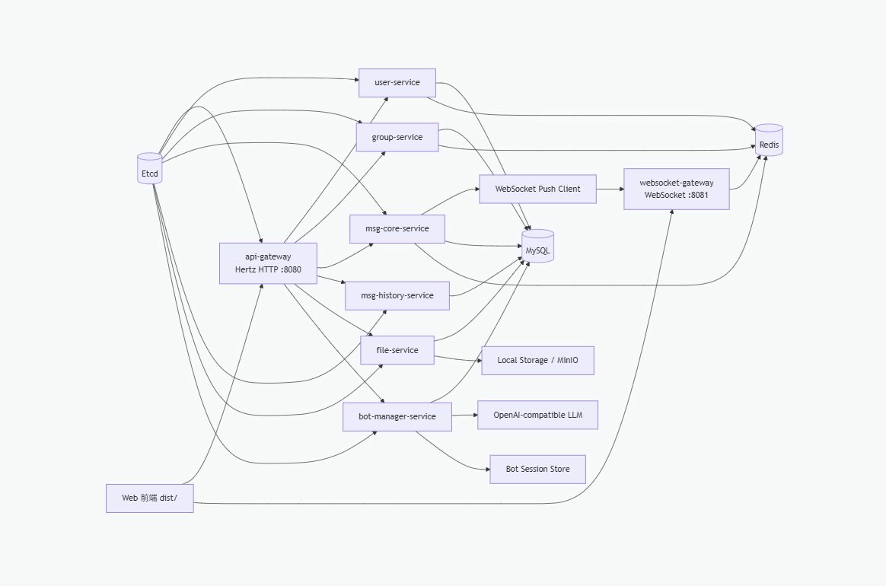
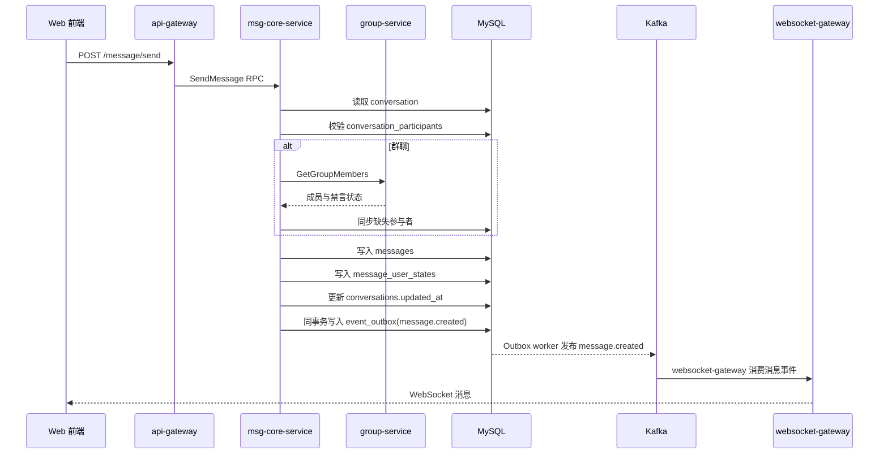

# ClaranAIM 技术设计与实现原理

本文档作为 ClaranAIM 的唯一技术设计与实现原理文档。它从项目定位、总体架构、服务职责、核心数据模型、分布式数据协作、数据流和关键机制等维度，逐层拆解 ClaranAIM 的完整技术实现逻辑。

## 项目定位与技术设计总览

ClaranAIM 是一个面向多人在线场景的 AIM 系统：AIM = Agent + Instant Messaging。IM 是基础聊天室能力，负责用户、好友、群聊、文本/图片/文件/语音消息、历史消息、实时推送、多端同步和消息治理；Agent 是增强层，负责将可配置 Bot、会话记忆、工具调用、RAG、多 Agent 协作嵌入到真实聊天体验中。

这个项目的核心不是单独做一个聊天工具，也不是单独做一个 Bot 平台，而是让 Agent 能在真实 IM 会话上下文里工作：用户可以和人聊天，也可以把 Agent 作为可管理、可路由、可计费、可扩展的智能参与者接入聊天室。

当前系统采用微服务架构，HTTP 网关、WebSocket 网关和多个 Kitex RPC 服务共同组成后端。服务发现使用 Etcd，配置加载使用 Viper，业务数据落 MySQL，热点数据和在线状态落 Redis，图片、文件、语音等对象落本地存储或 MinIO。



## Agent-Native AIM 设计

### 1. Agent 在 IM 中的基础定位

- 会话理解者：持续理解私聊、群聊、文件、语音和上下文变化。
- 信息整理者：自动总结群聊消息，提取结论、待办、风险和关键分歧。
- 知识沉淀者：把高价值聊天内容整理成 RAG 知识库条目，而不是让信息沉没在历史消息中。
- 协作执行者：根据会话意图调用 Tool、Skill、MCP 或业务 API，完成查询、创建、同步、通知、文档生成等动作。
- 个体助手：理解单个用户的表达习惯、偏好、长期目标和历史行为，提供个性化建议。
- 群体助手：理解群体协作模式，发现会议低效、信息遗漏、重复争论、责任不清等问题。

### 2. 真实会话中的 Agent 能力

#### 群聊总结

Agent 可以对群聊进行多层总结：

- 即时总结：用户离线后回来，生成“错过了什么”。
- 日总结/周总结：按时间窗口总结项目进展、结论、阻塞项。
- 主题总结：围绕某个议题聚合跨时间消息。
- 决策总结：提取谁提出了什么方案、最终倾向是什么、还有什么未确认。
- 待办提取：把“我来做”“明天给你”“需要改一下”转成结构化任务。

#### 群聊到 RAG 知识库

IM 中大量知识隐藏在聊天里，例如接口约定、业务规则、部署经验、故障复盘、客户反馈。Agent 可以将这些内容沉淀为知识库：

- 自动识别高价值片段：方案、规则、FAQ、经验、问题解决过程。
- 生成知识卡片：标题、摘要、来源消息、相关人员、标签、可信度。
- 支持人工确认：先进入候选区，由群主、管理员或知识负责人确认入库。
- 维护知识生命周期：过期提醒、冲突检测、相似知识合并。
- RAG 回流会话：当群里再次讨论相关问题时，Agent 主动引用已有知识。

#### 用户发言习惯点评

Agent 可以作为个人沟通教练，而不是简单评价用户：

- 表达风格分析：是否清晰、是否过长、是否缺少背景。
- 协作习惯分析：是否经常提出问题但不补充上下文，是否经常遗漏结论。
- 情绪与语气反馈：提示过激表达、误解风险、可以更温和的改写。
- 会议/群聊贡献分析：总结用户常贡献的主题、擅长方向和协作盲点。
- 私密性边界：这类分析默认只对本人可见，避免变成监控工具。

#### Agent 主动工作流

Agent 不应该只被动等待 @，还可以在明确授权下主动工作：

- 自动生成群公告草稿。
- 从聊天中生成日报、周报、会议纪要。
- 对接日历创建会议。
- 对接项目管理工具创建任务。
- 对接代码仓库总结 PR、Issue、发布记录。
- 对接文件系统整理上传资料。
- 对接搜索、RAG、数据库、内部 API 做事实查询。
- 在关键节点提醒负责人，例如“这个问题讨论了三次但没有 owner”。

### 3. Tool、Skill、MCP 与 Agent 运行时

AIM 需要一个可配置的 Agent 能力层，而不是写死几个 Bot：

- Tool：具体可调用能力，例如搜索、查数据库、创建任务、读文件、发通知。
- Skill：面向场景的流程能力，例如群聊总结、故障复盘、会议纪要、知识入库。
- MCP：连接外部工具生态，让 Agent 能接入更多第三方或本地能力。
- Memory：保存用户偏好、群聊背景、长期项目状态和历史互动模式。
- RAG：把聊天知识、文档知识、组织知识变成可检索上下文。
- Policy：控制 Agent 能看什么、能做什么、什么时候需要用户确认。

未来 bot-manager-service 更偏管理面，bot-runtime-service 更偏执行面。manager 负责 Bot 配置、路由、权限、计费和审计；runtime 负责 Agent 会话、工具调用、长期任务、流式事件、多 Agent 协作。

当前 Phase 2 已将这个边界落到代码层：

- `bot-manager-service` 保存 Bot/Agent 配置、`agent_user_id`、工作目录、工具策略和 `bot_permissions`。
- `bot-runtime-service` 独立暴露 Kitex RPC，负责 Eino DeepAgent、JSONL 长会话、web_search、answer_from_document/RAG、Skill 和本地工具后端。
- Agent 在 IM 里不是虚拟 sender，而是 user-service 中的真实系统用户；群聊 @Agent 时，bot-manager 消费 `claran.message.events` 的 `message.created` 事件，识别 `mention_user_ids` 中的 Agent 用户，调用 runtime 后再通过 msg-core-service 以 Agent 用户身份写回消息。
- user-service 会将 Agent 用户标记为 `is_system=true`，这类账号可作为群成员和消息发送者，但不能通过密码登录。
- Agent @ 分发使用 `agent_dispatch_records(event_id, agent_user_id)` 记录执行状态，Agent 回复使用 msg-core-service 的 `client_msg_id=agent:{event_id}:{agent_user_id}` 做消息落库幂等，避免 Kafka 重投或 offset 提交前崩溃导致重复回复。
- 高频聊天与 Agent 响应继续走 MySQL 消息事实表 + Transactional Outbox + Kafka；DTM 只适合后续低频强一致管理流程，例如创建系统用户和 Bot 记录的 Saga 补偿。

### 4. Agent 在 IM 中为什么重要

Agent 的价值来自真实上下文。IM 是上下文密度最高的软件形态之一：

- 有人：用户、好友、群成员、角色、组织关系。
- 有事：讨论、决策、任务、冲突、计划、文件。
- 有时间：消息流天然记录过程。
- 有语气：表达方式、情绪、协作风格都在其中。
- 有资料：图片、文件、语音、链接和未来的知识库。

因此 Agent 在 IM 中不是“附加功能”，而可能成为下一代 IM 的核心层。传统 IM 解决“把人连接起来”，AIM 要解决“让人和 Agent 在同一个上下文中协作”。当 Agent 能理解群聊、沉淀知识、调用工具、执行任务后，聊天室就不再只是消息容器，而会变成轻量工作台、生活助理、知识系统和自动化入口。

### 5. 产品形态规划

- Agent 作为群成员：可以被 @，也可以根据规则主动出现。
- Agent 作为个人助手：只服务本人，处理私密总结、提醒、改写、个人记忆。
- Agent 作为群助手：服务群空间，负责公告、总结、任务、知识库和协作质量。
- Agent 作为工作流入口：从一句聊天触发工具链，例如“把这段讨论整理成 PRD 并建任务”。
- Agent 作为知识管家：把长期聊天沉淀为可搜索、可引用、可更新的知识资产。
- Agent 作为多角色团队：产品、研发、测试、运维、设计等 Agent 在群中协作。
- Agent 群聊创新：联想gstack，在群聊中产生多个不同身份的Agent（如CEO，工程师），并让这些Agent互相协作

### 6. 技术演进规划

- Phase A：会话感知 Agent
  - 群聊总结、私聊总结、未读摘要、上下文问答。
  - 支持按会话、时间、主题拉取消息上下文。

- Phase B：记忆与知识沉淀
  - memory-service 保存用户偏好、群背景、长期项目状态。
  - rag-service 支持聊天内容自动入库、文档入库、知识检索。
  - 增加人工审核队列，避免错误知识污染知识库。

- Phase C：工具调用与工作流
  - bot-runtime-service 支持 Tool、Skill、MCP。
  - 支持异步任务、长任务进度、失败重试和用户确认。
  - 将 Agent 行为写入审计日志。

- Phase D：多 Agent 协作
  - 多 Bot 路由和角色分工。
  - Agent 之间可交接任务、互相补充上下文。
  - 群聊中支持“召集团队”式智能协作。

- Phase E：安全、权限与治理
  - 精细化权限：会话可见性、文件可见性、工具调用权限。
  - 敏感信息识别与脱敏。
  - Agent 行为审计、成本控制、管理员策略。
  - 用户可查看、编辑、删除自己的记忆。

### 7. 设计原则

- Agent 必须基于真实 IM 上下文工作，而不是孤立问答。
- Agent 的主动性必须可配置、可审计、可关闭。
- 知识入库必须有人类确认或可回滚机制。
- 用户画像和发言点评必须默认私密，不能变成组织监控。
- 工具调用必须有权限边界，高风险动作必须确认。
- AIM 的长期目标不是“在聊天里加一个 AI 按钮”，而是让 Agent 成为 IM 的原生协作层。

## 核心数据模型与分布式数据协作总览

### 用户与好友

主要表：

- `users`：账号、昵称、头像、邮箱、手机号、在线状态。
- `friendships`：用户与好友之间的关系、备注、分组。
- `friend_groups`：好友分组。

数据传递：

1. 用户登录请求经 api-gateway 转发到 user-service，由 user-service 完成密码校验并签发 Access Token / Refresh Token。
2. 前端带 JWT 请求好友列表。
3. user-service 从 MySQL 读取好友关系，并可结合 Redis 缓存返回。
4. 前端点击好友时调用 msg-core-service 创建或复用私聊 conversation。

### 群与群成员

主要表：

- `groups`：群名、群主、公告、是否置顶等。
- `group_members`：群成员、角色、禁言到期时间、加入时间。

数据传递：

1. 创建群时 group-service 写入群和成员。
2. group-service 发布 `group.created` 事件，payload 携带群 ID、群主和完整成员快照。
3. 邀请/踢出/解散群时，group-service 发布 `group.member_invited`、`group.member_kicked`、`group.deleted` 事件。
4. msg-core-service 消费 `claran.group.events`，创建或复用 group conversation，并同步 `conversation_participants`。
5. msg-core-service 发送群消息时仍会同步查询群成员和禁言状态，作为 Kafka 事件延迟或重放期间的权限兜底。

### 会话与消息

主要表：

- `conversations`：会话 ID、类型、群 ID、更新时间。
- `conversation_participants`：会话参与者，用于私聊/群聊会话列表、推送目标，同时保存 per-user 已读游标、草稿、置顶和通知设置。
- `messages`：消息 ID、会话 ID、发送者、客户端/内部幂等键、消息内容、消息类型、引用消息、消息状态、编辑标记、@ 列表、创建时间。
- `message_user_states`：用户级消息视图，保存投递时间、已读时间和本地删除时间。
- `message_edit_records`：消息编辑历史，保存原内容、新内容、编辑人和编辑时间。

消息数据分成两层：

- 服务端消息事实：`messages` 表表达“这条消息是否存在、属于哪个会话、谁发送、内容是什么、是否撤回或编辑”。除撤回、编辑、系统治理外，普通用户的本地操作不直接改这张表。
- 用户本地视图：`message_user_states` 表表达“某个用户是否已收到、是否已读、是否在自己的历史中删除了这条消息”。用户删除聊天记录只写 `local_deleted_at`，历史查询按当前用户过滤，不影响其他参与者。

这个拆分让离线同步、多端漫游、撤回、已读回执和 Agent 拉取上下文都有共同事实来源：Agent、搜索和审计读取 `messages`，用户界面读取 `messages + message_user_states` 组成的个人视图。

消息发送链路：



### 文件、图片、语音

主要表：

- `file_records`：内部雪花主键、对外 UUID 文件 ID、文件名、类型、大小、Content-Type、文件 URL、上传者、时间。

数据传递：

1. 前端选择图片、文件或录制语音。
2. api-gateway 接收 multipart 文件。
3. 网关把二进制写入本地 `storage/source` 或 MinIO。
4. 网关调用 file-service 保存元数据。
5. file-service 返回真实 `file_id`。
6. 前端优先把 `{"id":"file_id","url":"file_url","name":"filename"}` 这类 JSON 作为图片、文件或语音消息内容发送给 msg-core-service；旧的 `[img]...[/img]`、`[file]...[/file]`、`[voice]...[/voice]` 格式仅保留兼容。
7. 会话渲染时根据 `file_id` 生成下载 URL，图片直接预览，语音直接播放。

### Bot 与 Agent

主要表：

- `bots`：Bot 名称、类型、模型名、BaseURL、系统提示词、技能目录、所有者、启停状态。
- `bot_routes`：Bot 路由规则，用于未来按群、关键词、意图分发。
- `billing_records`：对话、错误、空回复等计费记录。

AI 对话链路：

1. 前端选择 AI 助手或创建 Bot。
2. api-gateway 调用 bot-manager-service。
3. bot-manager-service 根据 Bot 配置创建或复用 Agent。
4. Agent 读取会话记忆，调用 OpenAI-compatible LLM。
5. 回复返回前端，同时写入 session store 和计费表。

### 为什么会同时存在 group_members 和 conversation_participants

`group_members` 表达“谁属于这个群”，属于群管理领域；`conversation_participants` 表达“谁能在这个会话列表中看到该会话、谁是消息推送目标”，属于消息领域。

两者不合并，是因为：

- 私聊没有 group_members，但仍需要 conversation_participants。
- 群成员变化是 group-service 的事实来源。
- 消息推送需要快速获取会话参与者。
- 未来支持频道、临时会话、AI 参与者时，conversation_participants 更通用。

### 消息中的文件为什么不直接存二进制

消息表只保存引用，因为图片、文件、语音体积大，直接写入消息表会影响查询、分页、备份和冷热分层。对象存储负责二进制，file-service 负责元数据，msg-core-service 负责消息引用。

---

## 一、整体架构

### 1.1 架构图

```
┌──────────────────────────────────────────────────────────────────────┐
│                           前端 (dist/)                                │
│        登录/注册 · 聊天 · 好友 · 群组 · 群管理 · AI助手 · 文件传输      │
└──────┬──────────────────────────────┬────────────────────────────────┘
       │ HTTP (REST API)              │ WebSocket
       ▼                              ▼
┌──────────────┐              ┌──────────────────┐
│  api-gateway  │              │ websocket-gateway │
│  (Hertz :8080)│              │  (net/http :8081) │
│  JWT鉴权·路由  │              │  连接管理·消息推送  │
│  文件上传代理  │              │  在线状态同步       │
└──┬──┬──┬──┬──┬──┘              └────────┬─────────┘
   │  │  │  │  │                          │
   │  │  │  │  │  RPC (Kitex + TTHeader)  │ Kafka message events
   │  │  │  │  │  服务发现: Etcd           │
   ▼  ▼  ▼  ▼  ▼                          │
┌─────┐┌─────┐┌──────────┐┌─────┐┌────────┐│
│user ││group││msg-core  ││file ││bot-mgr ││
│svc  ││svc  ││svc       ││svc  ││svc     ││
│:9001││:9002││:9003     ││:9005││:9006   ││
└──┬──┘└──┬──┘└──┬───────┘└──┬──┘└──┬─────┘│
   │      │      │            │      │      │
   │      │      ▼            │      │      │
   │      │  ┌──────────┐     │      │      │
   │      │  │msg-history│     │      │      │
   │      │  │svc :9004  │     │      │      │
   │      │  └────┬─────┘     │      │      │
   ▼      ▼       ▼           ▼      ▼      │
┌────────────────────────────────────────────┘
│     MySQL (Docker :3306)                    │
│  users · friends · groups · messages        │
│  conversations · files · bots · billing     │
├────────────────────────────────────────────┐
│     Redis (Docker :6379)                    │
│  缓存 · 在线状态 · 未读消息计数              │
├────────────────────────────────────────────┐
│     MinIO (Docker :9000)                    │
│  图片 · 文件 · 语音 对象存储                │
├────────────────────────────────────────────┐
│     Etcd (Docker :2379)                     │
│  服务注册与发现                             │
└────────────────────────────────────────────┘
```

### 1.2 为什么是微服务而不是单体

| 维度 | 单体 | 微服务（当前选择） |
|------|------|-------------------|
| 表归属 | 所有表在一个数据库 | 每个服务管理自己的表，独立迁移 |
| 部署 | 改一行全量部署 | 改 user-service 不影响 msg-core-service |
| 扩容 | 整体扩容 | 消息服务压力大时只扩消息服务 |
| 故障隔离 | 一个模块崩溃全部崩溃 | 一个服务挂了不影响其他服务 |
| 技术选型 | 统一技术栈 | 未来 AI 服务可以用 Python |

### 1.3 各服务职责

| 服务 | 端口 | 框架 | 职责 |
|------|------|------|------|
| api-gateway | 8080 | Hertz | HTTP 入口，JWT 鉴权，路由分发，RPC 转发，文件上传代理 |
| websocket-gateway | 8081 | net/http + gorilla/websocket | WebSocket 连接管理，实时消息推送，在线状态同步 |
| user-service | 9001 | Kitex | 用户注册/登录/信息/好友/分组/在线状态 |
| group-service | 9002 | Kitex | 群组 CRUD/成员管理/权限校验/禁言/置顶/转让群主 |
| msg-core-service | 9003 | Kitex | 会话管理/消息发送/消息搜索/禁言校验/实时推送 |
| msg-history-service | 9004 | Kitex | 消息历史归档/离线消息/已读未读 |
| file-service | 9005 | Kitex | 文件元数据管理/MinIO 对象存储集成 |
| bot-manager-service | 9006 | Kitex | Bot/Agent 配置、真实用户身份绑定、权限、路由、计费、审计、@Agent 调度 |
| bot-runtime-service | 9007 | Kitex | Agent 执行、长会话、Eino DeepAgent、工具调用、RAG/WebSearch、结构化理解输出 |

---

## 二、分层架构详解

每个后端服务严格遵循四层架构，以 user-service 为例：

```
cmd/user-service/main.go          ← 启动入口：加载配置→初始化DB/Redis→创建Kitex Server
internal/user-service/
  ├── handler/handler.go           ← RPC 入口层：接收 Thrift 请求，转换参数，调用 Service
  ├── service/service.go           ← 业务逻辑层：核心业务规则，缓存读写，调用 DAO
  ├── dao/dao.go                   ← 数据访问层：纯数据库操作，不包含业务逻辑
  └── model/model.go               ← 数据模型层：GORM 模型定义，对应数据库表
```

### 2.1 各层职责边界

**Handler 层**（RPC 入口）
- 接收 Kitex 生成的 Thrift 请求结构体
- 参数校验（非空检查等）
- 调用 Service 层获取结果
- 将结果转换为 Thrift 响应结构体返回
- **不包含**任何业务逻辑或数据库操作

**Service 层**（业务核心）
- 实现所有业务规则（如：不能添加自己为好友、私聊去重等）
- 管理缓存读写策略（先查缓存→缓存未命中查DB→回写缓存）
- 缓存失效策略（写操作时主动删除相关 Key）
- 调用 DAO 层进行数据持久化
- 调用外部服务（如 PushClient 推送消息）

**DAO 层**（数据访问）
- 定义 Repository 接口（面向接口编程，便于测试和替换实现）
- 纯数据库 CRUD 操作
- 使用 GORM 的 `WithContext` 支持请求级超时控制
- **不包含**任何业务判断逻辑

**Model 层**（数据模型）
- GORM 结构体定义，映射数据库表
- `TableName()` 方法指定表名
- JSON tag 控制序列化行为
- `json:"-"` 隐藏密码字段

### 2.2 依赖注入

所有层通过构造函数注入依赖，而非在内部创建：

```go
// main.go 中的组装过程
db := dao.InitDB(cfg.MySQL.DSN)
redisClient := redis.NewRedisClient(...)
repo := dao.NewUserRepo(db)
svc := service.NewUserService(repo, redisClient)
handler := handler.NewUserServiceImpl(svc)

// Kitex Server 注册 handler
server := kitex.NewServer(handler, ...)
```

这样做的好处：
- **可测试**：可以注入 mock 实现进行单元测试
- **可替换**：DAO 实现可以替换为其他数据库驱动
- **解耦**：每层只依赖接口，不依赖具体实现

---

## 三、核心数据流

### 3.1 用户注册完整流程

```
前端 POST /api/v1/user/register
  │
  ▼
api-gateway: UserHandler.Register()
  │  1. BindJSON 解析请求体 {username, password, nickname}
  │  2. 调用 RPC: UserClient.Register(ctx, &RegisterReq{...})
  │
  ▼
user-service: UserServiceImpl.Register()
  │  1. 调用 Service: svc.Register(ctx, username, password, nickname)
  │
  ▼
user-service: userServiceImpl.Register()
  │  1. 校验用户名和密码非空
  │  2. repo.GetUserByUsername() → 检查用户名是否已存在
  │  3. password.HashPassword(pwd) → bcrypt 加密（cost=10）
  │  4. 昵称为空时默认等于用户名
  │  5. repo.CreateUser(ctx, &User{...}) → 写入 MySQL
  │  6. redis.SetJSON("user:info:{id}", user, 15min) → 缓存用户信息
  │
  ▼
返回 RegisterResp{success: true, user_id: 1, msg: "注册成功"}
```

### 3.2 用户登录完整流程

```
前端 POST /api/v1/user/login
  │
  ▼
api-gateway: UserHandler.Login()
  │  调用 RPC: UserClient.Login(ctx, &LoginReq{...})
  │
  ▼
user-service: userServiceImpl.Login()
  │  1. repo.GetUserByUsername() → 查询用户记录
  │  2. password.CheckPassword(pwd, user.Password) → bcrypt 校验
  │  3. jwt.GenerateAccessToken(...) + jwt.GenerateRefreshToken(...)
  │     → 生成 Access/Refresh JWT（HS256 签名，payload 含 userID、username、role、token_type、过期时间）
  │  4. user.Status = "online" → repo.UpdateUser() 更新状态
  │  5. redis.SetJSON("user:info:{id}", user, 15min) → 刷新用户缓存
  │  6. redis.Set("online:user:{id}", "1", 30min) → 设置在线标记
  │
  ▼
返回 LoginResp{success: true, access_token: "eyJ...", refresh_token: "eyJ...", user_id: 1, role: "user"}
```

### 3.3 发送消息完整流程（最核心）

这是整个系统最复杂的数据流，涉及 4 个服务协作：

```
前端 POST /api/v1/message/send
  │  {conversation_id: 1, content: "你好", msg_type: "text"}
  │
  ▼
api-gateway: MessageHandler.SendMessage()
  │  1. 从 JWT 上下文获取 userID
  │  2. 调用 RPC: MessageClient.SendMessage(ctx, &SendMessageReq{...})
  │
  ▼
msg-core-service: messageServiceImpl.SendMessage()
  │
  │  ── 第1步：校验 ──
  │  1. 校验 content 非空
  │  2. repo.GetConversationByID() → 校验会话存在
  │
  │  ── 第2步：持久化 ──
  │  3. repo.CreateMessage(ctx, &Message{...}) → 写入 messages 表
  │
  │  ── 第3步：更新会话时间戳 ──
  │  4. conv.UpdatedAt = msg.CreatedAt
  │  5. repo.UpdateConversation(ctx, conv) → 更新 conversations 表
  │
  │  ── 第4步：缓存更新 ──
  │  6. redis.SetJSON("conversation:recent:{id}", msg, 10min) → 缓存最近消息
  │  7. 遍历所有参与者 → redis.Del("user:conversations:{uid}") → 清除会话列表缓存
  │
  │  ── 第5步：发布消息事件 ──
  │  8. repo.GetParticipants(conversationID) → 获取所有参与者 userID
  │  9. eventbus.Publish(message.created, targetUserIDs, pushData)
  │     │
  │     ▼
  │  Kafka topic: claran.message.events
  │     │  key = conversation_id
  │     │  payload = {target_user_ids: [1,2], data fields...}
  │     │
  │     ▼
  │  websocket-gateway: message event consumer
  │     │  1. 解析 MessagePayload
  │     │  2. 构造 WebSocket 消息: {type: "new_message", data: {...}}
  │     │  3. h.Broadcast(targetUserIDs, data)
  │     │
  │     ▼
  │  hub.Hub.Broadcast()
  │     │  1. 遍历 targetUserIDs
  │     │  2. 查找每个用户在 Hub.clients 中的所有连接
  │     │  3. 将消息写入每个连接的 Send channel
  │     │
  │     ▼
  │  WSClient.WritePump()
  │     │  从 Send channel 读取消息 → websocket.WriteMessage → 浏览器收到消息
  │     ▼
  │  前端 onmessage 回调 → 渲染新消息气泡
  │
  ▼
返回 SendMessageResp{success: true, msg_id: 42, send_time: "..."}
```

### 3.4 Phase 1 高级消息状态

Phase 1 将消息从“纯文本记录”扩展为可协作的 IM 事件：

| 能力 | 存储位置 | 对外接口 | 实时事件 |
|------|----------|----------|----------|
| 已读游标/回执 | `conversation_participants.last_read_message_id/last_read_at` + `message_user_states.read_at` | `POST /message/read` | `message_read` |
| 引用/回复 | `messages.reply_to_id` | `POST /message/send` 的 `reply_to_id` | `new_message` 携带 `reply_to_id` |
| 编辑 | `messages.is_edited/edited_at` + `message_edit_records` | `PUT /message/edit` | `message_edited` |
| 撤回 | `messages.status=recalled` | `POST /message/recall` | `message_recalled` |
| @ 提及 | `messages.mention_user_ids/mention_all` | `POST /message/send` | `new_message` 携带 mention 字段 |
| 广播消息 | `messages.msg_type=broadcast` | `POST /message/send` | `new_message` |
| 时间范围搜索 | `messages.created_at` | `GET /message/search?start_at=&end_at=` | 无 |

撤回默认窗口为 2 分钟，由 msg-core-service 校验。编辑只允许消息发送者操作，已撤回消息不能继续编辑。会话列表 unread_count 由用户在该会话的 read cursor 和消息 ID 计算，前端打开会话后会上报最新消息已读。消息历史响应会额外返回 `read_count`、`recipient_count` 和 `is_read_by_me`，前端据此展示私聊已读/未读和群聊已读人数。

### 3.4 WebSocket 连接建立流程

```
前端: new WebSocket("ws://localhost:8081/ws?token=eyJ...")
  │
  ▼
websocket-gateway: WSHandler.ServeHTTP()
  │  1. 从 URL query 提取 token
  │  2. jwt.ParseToken(token) → 解析并验证 JWT
  │  3. Upgrader.Upgrade(w, r, nil) → HTTP 升级为 WebSocket
  │  4. 创建 WSClient 和 Hub.Client
  │  5. Hub.Register(client) → 注册到 Hub（按 userID 分组）
  │  6. redis.Set("online:user:{id}", "1", 30s) → 设置在线标记
  │  7. 启动两个协程：
  │     - go wsClient.ReadPump()  → 读取客户端消息 + 心跳检测
  │     - go wsClient.WritePump() → 推送消息 + 定时 ping
  │
  ▼
连接建立成功，进入长连接状态
```

---

## 四、核心机制详解

### 4.1 JWT 认证机制

**Token 生成**（登录时）：
```go
claims := Claims{
    UserID:    user.ID,        // 用户ID
    Username:  user.Username,  // 用户名
    Role:      user.Role,      // user/admin
    TokenType: "access",       // access/refresh
    StandardClaims: jwt.StandardClaims{
        ExpiresAt: now.Add(accessTTL).Unix(),
        IssuedAt:  now.Unix(),            // 签发时间
        Issuer:    "ClaranAIM",           // 签发者
    },
}
token := jwt.NewWithClaims(jwt.SigningMethodHS256, claims)
signedToken := token.SignedString([]byte(secretKey))  // HMAC-SHA256 签名
```

**Token 验证**（每次请求时）：
```
api-gateway 中间件: JWTAuthMiddleware()
  1. 从 Authorization 头提取 "Bearer <token>"
  2. jwt.ParseToken(token) → 只接受 token_type=access，验证签名 + 检查过期时间
  3. 解析出 claims.UserID、claims.Username、claims.Role
  4. 存入请求上下文: c.Set("userID", claims.UserID), c.Set("role", claims.Role)
  5. 后续 handler 通过 c.Get("userID") 获取当前用户ID
```

**Refresh Token 续签**：

- `POST /api/v1/user/token/refresh` 只接受 `token_type=refresh` 的 JWT。
- api-gateway 解析 Refresh Token 后，会通过 user-service 重新读取当前用户信息和当前 role，再签发新的 Access Token。
- Refresh Token 中的 role 只代表签发时快照，不作为续签时的最终权限来源，避免管理员降级后旧令牌继续保留管理权限。
- 管理接口统一通过 `RequireRole(jwt.RoleAdmin)` 挂载角色鉴权；当前 `/api/v1/admin` 是预留分组。

**WebSocket 认证**（特殊处理）：
- WebSocket 无法设置 HTTP Header，因此 Token 通过 URL 参数传递
- `ws://localhost:8081/ws?token=<JWT_TOKEN>`
- 服务端在 Upgrade 之前验证 Token

### 4.2 密码安全机制

```
注册时:
  明文密码 → bcrypt.GenerateFromPassword(password, cost=10) → $2a$10$...哈希值
  存入数据库的 password 字段是 60 字符的 bcrypt 哈希

登录时:
  明文密码 + 数据库中的哈希值 → bcrypt.CompareHashAndPassword()
  → 匹配返回 true，不匹配返回 false

为什么用 bcrypt 而不是 MD5/SHA256:
  - bcrypt 自带盐值（salt），无需额外存储
  - cost 参数控制计算复杂度，抵抗暴力破解
  - 每次生成的哈希值不同，防止彩虹表攻击
```

### 4.3 RPC 通信机制

**为什么用 Kitex + Thrift 而不是 gRPC + Protobuf**：
- Kitex 是字节跳动开源的高性能 RPC 框架，对 Thrift 协议有深度优化
- Thrift IDL 语法更简洁，适合快速定义服务接口
- TTHeader 传输协议提供更高效的序列化和反序列化

**IDL 定义 → 代码生成**：
```
idl/user.thrift → kitex_gen/user/
  ├── userservice/client.go    ← RPC 客户端桩代码
  ├── userservice/server.go    ← RPC 服务端桩代码
  └── user/model.go            ← 请求/响应结构体

idl/group.thrift → kitex_gen/group/...
idl/message.thrift → kitex_gen/message/...
idl/file.thrift → kitex_gen/file/
  ├── fileservice/client.go    ← 文件上传/下载/删除/列表
  └── file/model.go            ← FileMeta 结构体
idl/bot.thrift → kitex_gen/bot/
  ├── botservice/client.go     ← Bot CRUD/对话/路由/计费
  └── bot/model.go             ← BotConfig/BotRoute/BillingRecord
```

**RPC 客户端配置**（api-gateway 中）：
```go
UserClient, _ = userservice.NewClient("user-service",
    client.WithResolver(etcdResolver),              // Etcd 服务发现
    client.WithTransportProtocol(transport.TTHeader), // TTHeader 协议
)
```

**RPC 服务端配置**（各服务 main.go 中）：
```go
svr := userservice.NewServer(handler,
    server.WithServiceAddr(addr),
    server.WithRegistry(etcdRegistry),              // Etcd 服务注册
    kitexutil.WithServerMiddlewares(...),            // TTHeader meta handler
)
```

**服务发现流程**：
```
1. user-service 启动 → 向 Etcd 注册: key="/kitex/registry/user-service", value="127.0.0.1:9001"
2. api-gateway 启动 → 创建 EtcdResolver
3. RPC 调用时 → Resolver 从 Etcd 查询 "user-service" 的地址 → 建立连接 → 发送请求
4. Etcd 保持租约心跳 → 服务下线时租约过期自动注销
```

### 4.4 WebSocket 实时推送机制

**Hub 设计**（核心数据结构）：
```go
type Hub struct {
    clients    map[int64]map[*Client]bool  // userID → 该用户的所有连接
    broadcast  chan *BroadcastMessage       // 广播消息通道
    register   chan *Client                 // 注册通道
    unregister chan *Client                 // 注销通道
    mu         sync.RWMutex                // 读写锁保护 clients
}
```

**为什么 clients 是 `map[int64]map[*Client]bool` 而不是 `map[int64]*Client`**：
- 一个用户可能打开多个浏览器标签页/设备
- 每个标签页/设备对应一个 WebSocket 连接
- 所以一个 userID 可以对应多个 Client

**Hub.Run() 事件循环**：
```
for {
    select {
    case client := <-register:     // 新连接 → 加入 clients
    case client := <-unregister:   // 断开 → 从 clients 移除 + close(Send)
    case msg := <-broadcast:       // 推送消息 → 遍历目标用户的所有连接 → 写入 Send channel
    }
}
```

**消息推送链路**：
```
msg-core-service.SendMessage()
  → 发布 message.created/message.edited/message.recalled/message.read
    → 同事务写入 MySQL event_outbox
      → Outbox worker 发布 Kafka topic claran.message.events
        → websocket-gateway consumer 解析事件
        → hub.Broadcast(targetUserIDs, jsonData)
          → 遍历每个目标用户的所有连接
            → client.Send <- data
              → WritePump() 从 Send 读取
                → conn.NextWriter(TextMessage).Write(data)
                  → 浏览器 onmessage 回调
```

`/push` HTTP 接口仍保留为内部兼容入口；当前 msg-core-service 的主路径不再请求内直推，而是写 `event_outbox` 后由 worker 异步投递 Kafka。

**心跳保活**：
```
WritePump:
  每 54 秒发送 Ping 帧 → conn.WriteMessage(PingMessage, nil)

ReadPump:
  设置 ReadDeadline = 60 秒
  收到 Pong → 重置 ReadDeadline
  60 秒无 Pong → 断开连接 → 触发 Unregister
```

**在线状态同步**：
```
WebSocket 连接建立时:
  redis.Set("online:user:{id}", "1", 30s)

定时同步（每 10 秒）:
  遍历 Hub 中的在线用户 → 刷新 Redis TTL

WebSocket 断开时:
  Hub.Unregister → 从内存移除
  Redis 中的 key 会在 30s TTL 后自动过期
```

### 4.5 Redis 缓存策略

**缓存模式：Cache-Aside（旁路缓存）**

```
读取:
  1. 查 Redis → 命中 → 直接返回
  2. 查 Redis → 未命中 → 尝试获取 Redis 分布式锁 → 查 MySQL → 写入 Redis → 返回

写入:
  1. 写 MySQL
  2. 删除 Redis 缓存（而非更新）
  3. 依赖 TTL 作为兜底（防止删除失败导致脏数据）

为什么是删除缓存而不是更新缓存:
  - 删除更简单，不需要考虑并发更新的时序问题
  - 下次读取时自然会从 DB 加载最新数据
  - TTL 兜底保证最终一致性
```

**缓存防护策略**：

- 缓存雪崩：写入缓存时使用 TTL 随机抖动，避免大量 key 在同一时刻过期。
- 缓存穿透：数据库确定不存在的数据写入短 TTL 空值缓存，不使用布隆过滤器。
- 缓存击穿：热点 key 未命中时使用 Redis `SET NX PX` 分布式锁，释放锁使用 Lua 校验 token，避免误删其他请求的锁。
- 写后删除：所有写数据库操作成功后删除相关缓存，读路径负责按最新数据库状态回填。

**各服务缓存详情**：

user-service:
| 操作 | 缓存 Key | 策略 |
|------|---------|------|
| 注册 | `user:info:{id}` | 写库后写入缓存（TTL 15min + 抖动） |
| 登录 | `user:info:{id}` + `online:user:{id}` | 用户缓存回写，在线标记 TTL 带抖动 |
| 获取用户信息 | `user:info:{id}` | Cache-Aside + 分布式锁 + 空值缓存 |
| 更新用户信息 | `user:info:{id}` | 更新 DB 后删除缓存 |
| 获取好友列表 | `user:friends:{id}` | 先查缓存，空列表写空值缓存，TTL 带抖动 |
| 添加/删除好友 | `user:friends:{uid}` | 双向删除双方好友缓存 |
| 获取好友分组 | `user:friend_groups:{id}` | 先查缓存，空列表写空值缓存，TTL 带抖动 |
| 创建好友分组 | `user:friend_groups:{id}` | 删除缓存 |

msg-core-service:
| 操作 | 缓存 Key | 策略 |
|------|---------|------|
| 获取会话列表 | `user:conversations:{id}` | 先查缓存，空列表写空值缓存，TTL 带抖动 |
| 发送消息 | `conversation:recent:{id}` + `user:conversations:{uid}` | 最近消息 TTL 带抖动 + 清除所有参与者的会话列表缓存 |
| 创建会话 | `user:conversations:{uid}` | 清除所有参与者的会话列表缓存 |

group-service:
| 操作 | 缓存 Key | 策略 |
|------|---------|------|
| 获取群组信息 | `group:info:{id}` | Cache-Aside + 分布式锁 + 空值缓存 |
| 获取用户群组列表 | `user:groups:{uid}` | 先查缓存，空列表写空值缓存，TTL 带抖动 |
| 获取群成员列表 | `group:members:{id}` | 先查缓存，空列表写空值缓存，TTL 带抖动 |
| 创建/更新/删除群组 | `group:info:{id}` + `user:groups:{uid}` | 删除群组缓存 + 删除成员的群组列表缓存 |
| 添加/移除成员 | `group:members:{id}` + `user:groups:{uid}` | 删除成员列表缓存 + 删除被操作用户的群组列表缓存 |

### 4.6 数据库设计原则

**每个服务独立管理自己的表**：
- user-service 管理 users、friends、friend_groups 表
- group-service 管理 groups、group_members 表（含 is_muted、is_pinned、role 等扩展字段）
- msg-core-service 管理 conversations、conversation_participants、messages 表（含 group_id 字段）
- msg-history-service 管理 message_history、offline_messages 表
- file-service 管理 file_metas 表（文件元数据，实际文件存储在 MinIO）
- bot-manager-service 管理 bots、bot_routes、billing_records 表

**启动时自动迁移**：
```go
func InitDB(dsn string) (*gorm.DB, error) {
    db, _ := gorm.Open(mysql.Open(dsn), &gorm.Config{})
    
    for _, m := range models {
        db.AutoMigrate(m) // 非破坏性自动迁移：新增表/字段，不在启动时删表
    }
    return db, nil
}
```

**迁移策略约束**：
- 服务启动流程禁止 DropTable，避免重启清空用户、消息、文件和计费数据
- GORM AutoMigrate 只承担开发阶段的非破坏性迁移，适合新增表和新增字段
- 字段删除、类型变更、数据回填等复杂变更应使用迁移工具（如 golang-migrate）做增量迁移

### 3.6 分布式 ID 策略

项目不再依赖 MySQL 自增主键：

- 用户 ID：`users.id` 使用 10 位数字 UID，范围为 `1000000000` 到 `9999999999`。注册时生成随机 UID 并查重，用户可复制 UID 用于添加好友。
- 业务 ID：群、会话、消息、好友关系、Bot、计费记录、消息用户状态等使用 64 位雪花 ID。
- 雪花 ID 布局：毫秒级时间戳 + workerID + 同毫秒序列号。当前 workerID 可由本机信息兜底，后续多实例部署时可扩展为 Redis/Etcd 分配。
- 时钟回拨：小幅回拨短暂等待，超过阈值直接返回错误，避免生成重复 ID。

**好友关系是双向的**：
```
A 添加 B 为好友:
  friends 表插入两条记录:
    {user_id: A, friend_id: B, remark: "我的同事"}
    {user_id: B, friend_id: A, remark: ""}

A 删除 B:
  删除两条记录:
    WHERE user_id=A AND friend_id=B
    WHERE user_id=B AND friend_id=A
```

**私聊会话去重**：
```sql
SELECT * FROM conversations
WHERE type = 'private'
AND id IN (SELECT conversation_id FROM conversation_participants WHERE user_id = ?)
AND id IN (SELECT conversation_id FROM conversation_participants WHERE user_id = ?)
```
- 两个子查询取交集，找到同时包含两个用户的私聊会话
- 如果已存在则直接返回，不创建新的

### 4.7 配置管理机制

**三层配置加载**：
```
1. YAML 配置文件 (config/*.yaml)
   └── 定义所有配置项的结构和默认值

2. .env 环境变量文件
   └── 存放敏感信息（DSN、密码、密钥），不提交到 Git

3. 系统环境变量
   └── 最高优先级，用于生产环境覆盖
```

**加载流程**：
```go
func Load(configPath string) (*Config, error) {
    godotenv.Load()                    // 1. 加载 .env
    viper.AutomaticEnv()               // 2. 允许环境变量覆盖
    viper.SetConfigFile(configPath)
    viper.ReadInConfig()               // 3. 读取 YAML
    viper.Unmarshal(&cfg)              // 4. 反序列化
    applyEnvOverrides(&cfg)            // 5. 环境变量覆盖敏感字段
    return &cfg, nil
}
```

**环境变量覆盖优先级**：
```
系统环境变量 > .env 文件 > YAML 配置文件
```

---

## 五、API 网关设计

### 5.1 路由分组

```go
// 公开接口（无需认证）
public := r.Group("/api/v1")
public.POST("/user/register", ...)
public.POST("/user/login", ...)

// 认证接口（需要 JWT）
auth := r.Group("/api/v1")
auth.Use(middleware.JWTAuthMiddleware())
auth.GET("/user/info", ...)
auth.POST("/message/send", ...)
```

### 5.2 CORS 中间件

```go
func CORSMiddleware() app.HandlerFunc {
    // 设置允许的 Origin、Methods、Headers
    // OPTIONS 请求直接返回 204（预检请求）
    // 其他请求放行
}
```

为什么需要 CORS：
- 前端运行在 `http://localhost:5500`（Live Server）
- API 网关运行在 `http://localhost:8080`
- 浏览器同源策略会阻止跨域请求
- CORS 中间件告诉浏览器"允许跨域"

### 5.3 统一响应格式

```go
type Response struct {
    Code    int         `json:"code"`
    Message string      `json:"message"`
    Data    interface{} `json:"data"`
}
```

- `code=0`：成功
- `code=-1`：服务器内部错误
- `code=400`：参数错误
- `code=401`：未认证
- `code=403`：无权限

---

## 六、前端实现原理

### 6.1 技术选型

- 纯 HTML/CSS/JavaScript（无框架依赖）
- 目的：零构建步骤，直接浏览器打开即可测试

### 6.2 页面结构

```
index.html
  ├── 登录/注册页面（默认显示）
  └── 聊天主页面（登录后显示）
       ├── 左侧边栏
       │    ├── 会话列表
       │    ├── 好友列表
       │    └── 群组列表
       └── 右侧聊天区域
            ├── 消息列表
            └── 输入框
```

### 6.3 WebSocket 集成

```javascript
// 登录成功后建立 WebSocket
const ws = new WebSocket(`ws://localhost:8081/ws?token=${token}`);

// 接收消息
ws.onmessage = (event) => {
    const msg = JSON.parse(event.data);
    if (msg.type === 'new_message') {
        // 判断是否是当前会话的消息
        if (msg.data.conversation_id === currentConversationId) {
            renderMessage(msg.data);  // 直接渲染
        } else {
            showNotification(msg.data);  // 显示通知
        }
    }
};

// 断线重连
ws.onclose = () => {
    setTimeout(() => connectWebSocket(token), 3000);
};
```

### 6.4 消息去重

```javascript
const sentMessageIds = new Set();

// 发送消息时记录 ID
function onSendSuccess(msgId) {
    sentMessageIds.add(msgId);
}

// 收到 WebSocket 推送时检查
ws.onmessage = (event) => {
    const msg = JSON.parse(event.data);
    if (sentMessageIds.has(msg.data.msg_id)) {
        sentMessageIds.delete(msg.data.msg_id);
        return;  // 跳过自己发送的消息（已在发送时渲染）
    }
    renderMessage(msg.data);
};
```

为什么需要去重：
- 发送消息时前端会立即渲染（乐观更新）
- 同时 WebSocket 也会推送这条消息回来
- 不去重会导致消息显示两次

---

## 七、Docker 基础设施

### 7.1 docker-compose.yaml

```yaml
services:
  mysql:        # 数据库 - 端口 3306
  redis:        # 缓存 - 端口 6379
  etcd:         # 服务注册发现 - 端口 2379
  minio:        # 对象存储 - 端口 9000(API) + 9009(控制台)
  kafka:        # 事件总线 - 端口 9092，控制器 9093；服务配置默认启用
  dtm:          # 分布式事务协调器 - HTTP 36789，gRPC 36790；默认配置已开启，按业务需要接入 Saga/TCC 分支
```

### 7.2 服务连接方式

所有服务通过 `localhost:{port}` 连接 Docker 容器：
- MySQL: `claran:chr070309@tcp(localhost:3306)/ClaranCloudDisk?charset=utf8mb4&parseTime=True&loc=Local`
- Redis: `localhost:6379`，无密码，DB 0
- Etcd: `http://localhost:2379`
- MinIO: `localhost:9000`，Bucket 由 `MINIO_BUCKET_NAME` 或服务配置决定；当前 `config/file-service.yaml` 默认 `claranaim`
- Kafka: `127.0.0.1:9092`，当前使用 topic `claran.group.events` 和 `claran.message.events`
- DTM: `http://localhost:36789`，配置默认开启，并通过 `pkg/dtm` 提供 Saga 构建器；当前用于“创建群组 + 创建群聊会话”的低频跨服务 Saga，不替代 Outbox 高频事件可靠发布。

---

## 八、启动流程

### 8.1 完整启动顺序

```
1. docker-compose up -d          → 启动 MySQL、Redis、Etcd、MinIO、Kafka、DTM
2. 等待 MySQL 初始化完成（约 10 秒）
3. scripts/start.bat             → 依次启动 8 个后端服务
   ├── user-service (:9001)      → 自动建表 + 注册到 Etcd
   ├── group-service (:9002)     → 自动建表 + 注册到 Etcd
   ├── msg-core-service (:9003)  → 自动建表 + 注册到 Etcd
   ├── msg-history-service (:9004) → 自动建表 + 注册到 Etcd
   ├── file-service (:9005)      → 自动建表 + 注册到 Etcd + 初始化 MinIO Bucket
   ├── bot-manager-service (:9006) → 自动建表 + 注册到 Etcd
   ├── api-gateway (:8080)       → 初始化 RPC 客户端（从 Etcd 发现服务）
   └── websocket-gateway (:8081) → 启动 Hub 事件循环
4. 浏览器打开 dist/index.html    → 前端页面
```

### 8.2 为什么有启动顺序要求

- api-gateway 依赖 Etcd 中的服务注册信息
- 如果 user-service 还没注册到 Etcd，api-gateway 的 RPC 调用会失败
- start.bat 中通过 `timeout /t 3` 在每个服务之间等待 3 秒

---

## 九、安全设计

| 安全措施 | 实现位置 | 说明 |
|---------|---------|------|
| 密码加密 | pkg/password | bcrypt，cost=10，自带盐值 |
| JWT 签名 | pkg/jwt | HMAC-SHA256，密钥从环境变量读取 |
| 敏感信息隔离 | .env + Viper | DSN/密钥不硬编码在代码中 |
| JWT 中间件 | api-gateway/middleware | 所有业务接口强制认证 |
| WebSocket 认证 | websocket-gateway/handler | 连接时验证 Token |
| CORS 限制 | api-gateway/middleware | 开发阶段允许所有来源 |
| SQL 注入防护 | GORM | 参数化查询，不拼接 SQL |
| 用户存在性校验 | api-gateway/user-service | 添加好友/创建群组/发送消息前校验 |
| 群聊禁言校验 | msg-core-service | 发送消息前检查群成员禁言状态 |
| Bot API Key 隐藏 | bot-manager-service | 内部 Bot 响应中隐藏 API Key |

---

## 十、性能设计考量

| 设计点 | 当前实现 | 未来优化方向 |
|-------|---------|------------|
| 消息存储 | 同步写 MySQL，事件同事务写 `event_outbox` | 若采用 Redis 缓冲，必须使用 Redis Stream/AOF/ACK 或数据库 Outbox 保证可重放，不能只写普通缓存后批量落盘 |
| 消息推送 | Outbox worker 发布 Kafka message events | 扩展离线推送、搜索索引、AI 后处理消费者 |
| 会话列表 | 每次查 DB 拼装 | Redis Sorted Set 维护 |
| 在线状态 | Redis String + TTL | Redis Set + 定时刷新 |
| 历史消息分页 | 游标分页（before_id） | 已实现，无需优化 |
| 批量用户查询 | 逐个查缓存 | Pipeline 批量查询 Redis |

---

## 十一、文件服务实现原理

### 11.1 整体架构

```
前端 <input type="file">
  │
  ▼
api-gateway: FileHandler.Upload()
  │  1. 解析 multipart/form-data
  │  2. 直接上传文件到 MinIO（不经过 RPC 传输大文件）
  │  3. 调用 RPC: FileClient.CreateFileMeta() → 记录文件元数据到 MySQL
  │
  ▼
file-service: FileMeta 持久化
  │  存储文件名、大小、类型、MinIO Key、上传者等元信息
  │
  ▼
MinIO: 实际文件存储
  │  Bucket: claranaim（可通过 MINIO_BUCKET_NAME 覆盖）
  │  Key: uploads/{timestamp}_{filename}
```

### 11.2 为什么文件上传在 API 网关层处理

- **避免大文件通过 RPC 传输**：Thrift RPC 不适合传输大文件，会增加序列化开销
- **减少一跳网络延迟**：文件直接从网关到 MinIO，不需要经过 file-service 中转
- **file-service 只管元数据**：文件的实际存储由 MinIO 负责，file-service 只记录元信息

### 11.3 文件下载流程

```
前端 GET /api/v1/file/{id}
  │
  ▼
api-gateway: FileHandler.GetFile()
  │  1. 调用 RPC: FileClient.GetFileMeta() → 获取文件元信息
  │  2. 从 MinIO 读取文件流
  │  3. 设置 Content-Disposition 头 → 浏览器下载
  │
  ▼
返回文件二进制流
```

### 11.4 MinIO 配置

| 配置项 | 环境变量 | 说明 |
|-------|---------|------|
| Endpoint | MINIO_ENDPOINT | MinIO 服务地址，默认 localhost:9000 |
| Access Key | MINIO_ROOT_USER | 认证用户名 |
| Secret Key | MINIO_ROOT_PASSWORD | 认证密码 |
| Bucket | MINIO_BUCKET_NAME | 存储桶名称，当前配置默认 claranaim |
| Use MinIO | MINIO_USE_MINIO | 是否使用 MinIO（false 则存本地） |

---

## 十二、Bot 管理服务实现原理

### 12.1 Bot 类型区分

```
┌─────────────────────────────────────────────┐
│              Bot 类型                        │
├──────────────────┬──────────────────────────┤
│    内部 Bot       │      自部署 Bot           │
├──────────────────┼──────────────────────────┤
│ 使用系统默认      │ 用户自己提供               │
│ API Key + URL    │ API Key + Base URL        │
│ 不可编辑密钥字段  │ 可编辑所有配置              │
│ 由管理员创建      │ 任何用户可创建              │
│ 配置来源:         │ 配置来源:                  │
│  .env 中的        │ 创建时用户填写              │
│  LLM_DEFAULT_*   │                           │
└──────────────────┴──────────────────────────┘
```

**内部 Bot 的 API Key 来源**：
```
.env 文件:
  LLM_DEFAULT_API_KEY=sk-xxx
  LLM_DEFAULT_BASE_URL=https://api.openai.com/v1
  LLM_DEFAULT_MODEL=gpt-4o-mini

bot-manager-service.yaml:
  llm:
    default_api_key: ${LLM_DEFAULT_API_KEY}
    default_base_url: ${LLM_DEFAULT_BASE_URL}
    default_model: ${LLM_DEFAULT_MODEL}

创建内部 Bot 时:
  svc.CreateBot(ctx, ..., defaultAPIKey, defaultBaseURL, defaultModel)
  → 自动填充 API Key 和 Base URL
```

**自部署 Bot**：
- 用户创建时必须提供 API Key 和 Base URL
- 前端动态显示/隐藏密钥配置字段（内部 Bot 隐藏，自部署 Bot 显示）

### 12.2 Agent 对话流程

```
前端 POST /api/v1/bot/chat
  │  {bot_id: 1, message: "你好"}
  │
  ▼
api-gateway: BotHandler.Chat()
  │  调用 RPC: BotClient.ChatWithBot(ctx, &ChatWithBotReq{...})
  │
  ▼
bot-manager-service: ChatWithBot()
  │
  │  ── 第1步：校验 ──
  │  1. 查询 Bot 配置 → 校验 Bot 存在且已启用
  │  2. 校验 API Key 和 Base URL 非空
  │
  │  ── 第2步：创建 Agent ──
  │  3. getOrCreateAgent() → 根据配置创建或复用 Agent
  │     │
  │     ▼
  │  component.NewChatModel(ctx, apiKey, baseURL, modelName)
  │     │  确保 BaseURL 以 "/v1" 结尾
  │     │  创建 OpenAI ChatModel 实例
  │     │
  │     ▼
  │  agent.NewAgent(ctx, chatModel, tools, ...)
  │     │  注册工具（graphTool/rag/websearch）
  │     │  配置系统 Prompt
  │     │  配置对话记忆（sessionStore）
  │
  │  ── 第3步：执行对话 ──
  │  4. ag.Run(ctx, &AgentInput{Messages: [UserMessage]})
  │     │  返回 AsyncIterator[AgentEvent]
  │     │
  │     ▼
  │  遍历事件流:
  │     event.Output.MessageOutput.GetMessage() → 提取回复内容
  │
  │  ── 第4步：计费记录 ──
  │  5. 从 Eino schema.Message.ResponseMeta.Usage 读取 PromptTokens/CompletionTokens
  │  6. 按模型输入/输出单价计算费用
  │  7. recordBilling() → 写入 billing_records 表
  │
  ▼
返回 ChatWithBotResp{success: true, reply: "..."}
```

### 12.3 Bot 路由管理

```
BotRoute 模型:
  ├── id          路由ID
  ├── bot_id      关联的Bot
  ├── path        路由路径（如 /api/bot/chat）
  ├── method      HTTP方法（POST/GET）
  ├── description 路由描述
  └── is_active   是否启用

用途：
  - 为每个 Bot 定义可访问的 API 路由
  - 支持动态启用/禁用路由
  - 未来可扩展为 API Gateway 级别的路由分发
```

### 12.4 计费管理

```
BillingRecord 模型:
  ├── id          记录ID
  ├── bot_id      关联的Bot
  ├── user_id     使用者
  ├── conversation_id 关联会话ID
  ├── action      操作类型（chat/chat_usage_missing/chat_error/chat_empty）
  ├── token_count 输入 + 输出 Token 总数
  ├── input_tokens  模型响应 usage.prompt_tokens
  ├── output_tokens 模型响应 usage.completion_tokens
  ├── model_name  模型名称
  ├── cost        按真实 Token 用量和模型单价计算的费用
  └── created_at  记录时间

计费策略：
  - Token 数只来自 Eino 返回的 schema.Message.ResponseMeta.Usage，不使用字符数估算。
  - 当前记录 input_tokens/output_tokens/token_count，费用按模型输入/输出单价分别计算。
  - 如果兼容模型接口没有返回 usage，记录 action=chat_usage_missing，Token 和费用按 0 写入，避免猜测计费。
```

---

## 十三、群聊禁言机制

### 13.1 数据模型

```
GroupMember 扩展字段:
  ├── is_muted    是否被禁言
  ├── muted_until 禁言到期时间（永久禁言为 NULL）
  ├── role        成员角色：owner/admin/member
  └── is_pinned   会话是否置顶
```

### 13.2 禁言校验流程

```
前端 POST /api/v1/message/send
  │
  ▼
api-gateway: MessageHandler.SendMessage()
  │  1. 获取会话参与者
  │  2. 校验参与者是否存在（防止与已删除用户对话）
  │  3. 调用 RPC: MessageClient.SendMessage()
  │
  ▼
msg-core-service: SendMessage()
  │  1. 校验消息内容非空
  │  2. 校验会话存在
  │  3. ★ 禁言校验 ★
  │     │
  │     ▼
  │  如果 conversation.GroupID != 0:
  │     调用 group-service RPC: GetGroupMember(groupID, senderID)
  │     │
  │     ▼
  │  检查 member.IsMuted:
  │     - true 且 MutedUntil 为 NULL → 永久禁言，拒绝发送
  │     - true 且 MutedUntil > now → 限时禁言，拒绝发送
  │     - true 且 MutedUntil < now → 禁言已过期，允许发送
  │     - false → 允许发送
  │
  │  4. 持久化消息
  │  5. 更新会话时间戳
  │  6. WebSocket 推送
```

### 13.3 权限控制

```
操作权限矩阵:
┌──────────┬──────┬───────┬────────┐
│ 操作      │ 群主  │ 管理员 │ 普通成员 │
├──────────┼──────┼───────┼────────┤
│ 转让群主  │  ✅   │  ❌   │  ❌    │
│ 设置管理员│  ✅   │  ❌   │  ❌    │
│ 禁言成员  │  ✅   │  ✅   │  ❌    │
│ 踢出成员  │  ✅   │  ✅   │  ❌    │
│ 修改群信息│  ✅   │  ✅   │  ❌    │
│ 发送消息  │  ✅   │  ✅   │  ✅*   │
│ 邀请成员  │  ✅   │  ✅   │  ✅    │
└──────────┴──────┴───────┴────────┘
  * 普通成员在未被禁言时可发送消息
```

---

## 十四、统一日志系统

### 14.1 设计目标

- 所有服务使用统一的日志格式
- 每条日志包含：时间戳、日志级别、服务名、消息、结构化字段
- 基于 `go.uber.org/zap` 输出到控制台，并同步写入本地日志文件
- 标准库 `log.Printf/log.Println` 已被桥接到统一 logger，旧代码日志也会落盘

### 14.2 日志格式

```
[user-service] 2026-05-17 19:36:23.654 INFO  cmd/user-service/main.go:31 数据库初始化成功
[msg-core-service] 2026-05-17 19:36:23.704 ERROR internal/msg-core-service/service.go:820 发送消息失败 {"error":"禁言中","user_id":1000000001,"conv_id":5}
```

### 14.3 本地日志文件

默认写入项目根目录：

```text
logs/<service>/<YYYY-MM-DD>/INFO.log
logs/<service>/<YYYY-MM-DD>/ERR.log
```

- `INFO.log`：记录 `INFO/WARN/ERROR/FATAL` 等所有业务日志。
- `ERR.log`：只记录 `ERROR/FATAL`，用于快速定位错误。
- `CLARAN_LOG_DIR` 可覆盖日志根目录，例如 `CLARAN_LOG_DIR=D:\ClaranAIMLogs`。
- 日志按日期自动切分；服务启动时会使用 `logger.InitService("<service>")` 初始化对应服务目录。

### 14.4 使用方式

```go
// 初始化（main.go 中）
logger.InitService("user-service")

// 基本日志
logger.Info("数据库初始化成功")
logger.Warn("Redis连接失败，将仅使用数据库", "error", err)
logger.Error("发送消息失败", "error", err, "user_id", userID)
logger.Fatal("服务启动失败", "error", err)  // Fatal 会调用 os.Exit(1)
```

### 14.5 结构化字段

```go
// 支持键值对字段，便于日志检索和分析
logger.Info("消息发送成功",
    "msg_id", msgID,
    "conv_id", convID,
    "sender_id", senderID,
    "elapsed", time.Since(start),
)
// 输出到控制台和 logs/msg-core-service/<date>/INFO.log
```

---

## 十五、输入校验与安全防护

### 15.1 用户存在性校验

```
添加好友:
  user-service.AddFriend()
    → 先查询 friendID 对应的用户是否存在
    → 不存在则返回错误，防止添加不存在的用户

创建群组/邀请成员:
  api-gateway.CreateGroup() / InviteMember()
    → 遍历成员列表，逐个调用 UserClient.GetUserInfo()
    → 任何成员不存在则拒绝操作

创建会话:
  api-gateway.CreateConversation()
    → HTTP 层只解析参数并调用 user-service 校验参与者是否存在
    → 具体会话创建、私聊去重、群聊参与者同步由 msg-core-service 负责
  group-service.CreateGroup()/InviteMember()
    → 发布 group.* Kafka 事件
    → msg-core-service 消费后创建或同步群聊会话参与者

发送消息:
  api-gateway.SendMessage()
    → 获取会话参与者
    → 校验每个参与者仍然存在
    → 已删除用户参与则拒绝发送
```

### 15.2 在线状态一致性

```
登录时:
  user-service.Login()
    → 更新用户状态为 online
    → 刷新用户缓存
    → 清除所有好友的好友列表缓存 → 强制好友重新加载（看到在线状态）

登出时:
  user-service.Logout()
    → 更新用户状态为 offline
    → 刷新用户缓存
    → 清除好友的好友列表缓存

WebSocket 断开时:
  → Redis 中 online:user:{id} 的 TTL 自动过期（30秒）
  → 下次好友查询时从 DB 读取最新状态
```

---

## 十六、未来功能规划与演进路线

### 16.1 IM 增强

- 已读回执：新增 per-user message read cursor，支持“已读到哪一条”。
- 消息引用与回复：消息表增加 reply_to_id，前端显示引用卡片。
- 限时撤回与编辑：新增消息状态和编辑记录。
- 离线推送与上线同步：msg-history-service 维护离线游标。
- 多端同步：同一用户多设备共享已读、草稿、置顶、通知设置。
- 实时审核与多语言翻译：由未来 msg-filter-service 承载。

### 16.2 Agent 与 AI 增强

- bot-runtime-service：承载更复杂的 Agent 运行时，与 bot-manager-service 分离。
- memory-service：沉淀用户偏好、群聊摘要、跨会话长期记忆。
- rag-service：支持知识库、文档上传、向量检索、私有/公共知识范围。
- MCP 工具集成：让 Agent 能调用外部工具、数据库、浏览器或业务系统。
- 多 Agent 协作：不同角色 Agent 在同一群中协同处理问题。
- 上下文摘要与待办提取：从历史聊天中生成要点、行动项和回复建议。

### 16.3 安全与治理

- msg-filter-service：敏感内容检测、实时审核、多语言翻译。
- 服务降级与重试：API 网关已接入令牌桶限流；Kitex 客户端已接入 RPC 超时、加权轮询和熔断；Kitex 服务端已接入连接数/QPS 限制。后续仍需补充按业务错误码的降级策略和幂等重试。
- Kafka：已用于群组事件同步和消息实时推送；`group.*` 与 `message.*` 已通过 MySQL Transactional Outbox 覆盖生产前崩溃窗口。后续继续补消费者幂等、搜索索引、AI 后处理和审计事件流，详见 `docs/ReliabilityAndEventConsistency.md`。
- DTM：已作为默认开启的基础设施接入 Docker Compose、配置系统和 `pkg/dtm`，并用于创建群组时协调 group-service 与 msg-core-service。当前不强行改造高频消息链路，避免把 Outbox 已覆盖的事件可靠发布问题复杂化；后续低频跨服务补偿事务可按 Saga/TCC 接入。
- 可观测性：Prometheus、Jaeger、Grafana、ELK。
- 压测：K6 场景覆盖登录、会话列表、群聊消息、文件上传、Bot 对话。
- 部署：Kubernetes、滚动升级、配置中心、灰度发布。

### 16.4 总体演进路线

1. 稳定 IM 核心：会话、历史、未读、多媒体、群权限。
2. 补齐高级 IM：已读、引用、撤回、编辑、离线、多端、审核、翻译。
3. 完善 Agent 助手：Bot 管理、路由、记忆、计费、上下文总结。
4. 引入事件总线：将消息、文件、AI 后处理、搜索索引异步化。
5. 构建知识与记忆层：RAG、memory-service、长期偏好。
6. 工程化上线：可观测性、压测、K8s、服务治理、安全审计。
